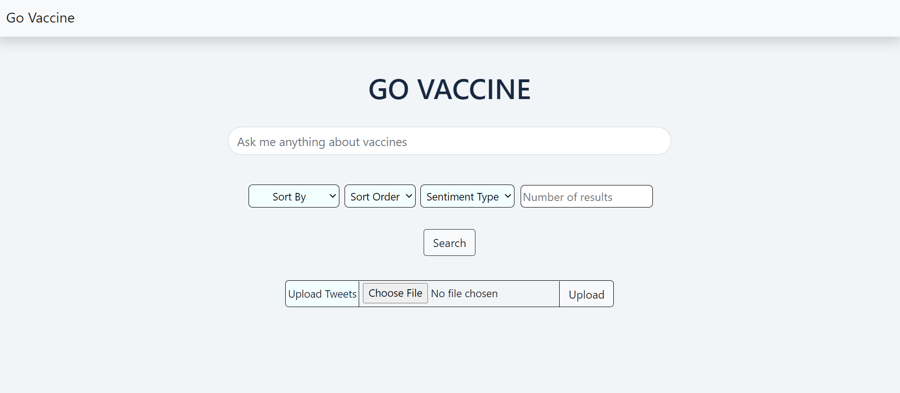
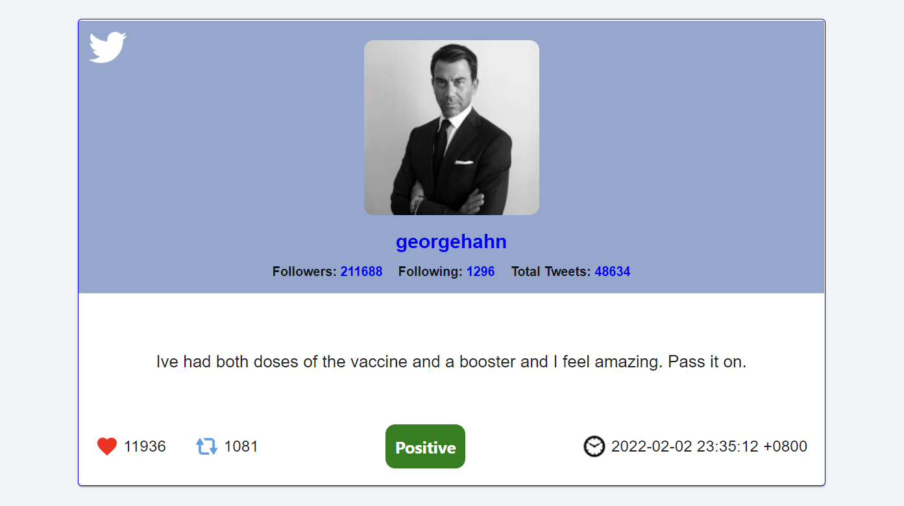

# CZ4034 Information Retrieval Project

This is the search engine web app for our CZ4034 project.

## Backend

To run backend:
1. Change directory to backend/solr-8.11.1/bin, then run "solr start" in command line.
2. Change directory back to to "backend" folder, run "pip install -r requirements.txt" to install dependencies.
3. Finally, run "python backend.py".

## Frontend

To run frontend:
1. Change directory to frontend/govaccine, then run "npm install" to install dependencies.
2. Run "npm start" to start search engine app, the app will run on http://localhost:3000/.

## Classification
Classification Models and Datasets used can be found at this [Google Drive Link](https://drive.google.com/drive/folders/1-26pAI5q1VBHyiLc0kOp4njPdFFlbh85).

## Search Engine App Interface

 

